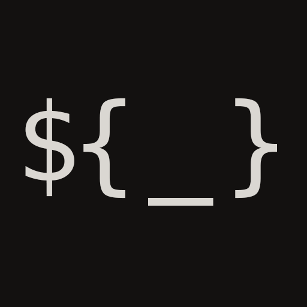

#  KutCode.KeyInject

`KutCode.KeyInject` is a .NET library designed to inject values into configurations using regular expression patterns, with support for nested patterns. This facilitates dynamic and flexible configuration management in .NET applications.

<h2 id="toc">📋 Table of contents</h2>
- [🧩 Features](#features)  
- [📜 Installation](#installation)  
- [🚀 Quick Start](#quick-start)  
  - [Basic example](#basic-example)  
- [⚙️ Basic Configuration](#basic-config)  
- [🎭 Patterns](#patterns)  
- [🪆 Nested patterns](#nested-patterns)  
- [💉 Dependency Injection](#di)  
- [☕ Contribution](#contribution)  

<h2 id="features">🧩 Features</h2>

- **Regex-Based Injection**: Utilize regular expressions to identify and replace placeholders in your configuration files.
- **Nested Pattern Support**: Handle complex configurations with nested placeholders seamlessly.
- **Easy Integration**: Designed for straightforward integration into existing .NET projects.
- **Supported versions**: `net8.0` and `net9.0` and higher version supported

<h2 id="installation">📜 Installation</h2>

Install `KutCode.KeyInject` using NuGet Package Manager:

```powershell
Install-Package KutCode.KeyInject
```

Or via the .NET CLI:

```shell
dotnet add package KutCode.KeyInject
```

All versions can be found [here](https://www.nuget.org/packages/KutCode.KeyInject/).

<h2 id="quick-start">🚀 Quick Start</h2>

See actual examples here [./examples](./examples);

<h3 id="basic-example">Basic example</h3>

```csharp
using KeyInject;

var builder = WebApplication.CreateBuilder(args);

// Configuration order is up to you.
// Remember, that ConfigurationProviders overrides each other!
builder.Configuration.AddJsonFile("appsettings.json");
builder.Configuration.AddEnvironmentVariables();
builder.Configuration.AddVault();
// ✅ Exactly at last position add Key Injection 
builder.Configuration.AddKeyInject();

var app = builder.Build();
// ... any app logic
await app.RunAsync();
```

<h2 id="basic-config">⚙️ Basic Configuration</h2>
<h3 id="from-appsettings">From `appsettings.json`</h3>

KeyInject always enriches from `appsettings.json`.  
It's not neccessary to provide json configuration.  
By default, `${_}` pattern will be used. _(All the patterns will be described below)_

<h4 id="example-configuration">Example configuration</h4>

```json
{
  "KeyInject": {
    "Enabled": true,
    "IgnoreCase": true,
    "ReplaceRepeatCount": 10,
    // if Patterns is empty, "${_}" pattern will be used anyway
    "Patterns": [
      "${_}", "{{_}}", "$<_>", "<<_>>", "!{_}!", "%_%"
    ],
    "KeyPrefixes": [
      "PRE_", "DB_"
    ]
  }
}

```
Extended configuration see in [💉 Dependency Injection](#di) part.

<h2 id="patterns">🎭 Patterns</h2>
<h3 id="preset-patterns">Preset patterns</h3>

By default few patterns are supported:
```text
pattern/regex
${_}    -   \$\{(?<key>[^\{\}]+)\}
{{_}}   -   \{\{(?<key>[^\{\}]+)\}\}
$<_>    -   \$<(?<key>[^<>]+)>
<<_>>   -   <<(?<key>[^<>]+)>>
!{_}!   -   !\{(?<key>[^{}]+)\}!
%_%     -   %(?<key>[^%]+)%
```
  
⚠️ Notice! You must specify them exactly in provided format!  
Pattern like `"${...}"` instead of `${_}` is not supported!  
  
Of course, you can use multiple patterns at the same time.

<h3 id="custom-patterns">🔧 Custom patterns</h3>

You can use custom Regex patterns with builder or appsettings configuration.  
You must to specify `?<key>` regex group in pattern, like:
```regexp  
!\{(?<key>[^{}]+)\}!
```
⚠️ Group naming must be exactly - `key`.


<h2 id="nested-patterns">🪆 Nested patterns</h2>

You can use nested patterns, here is an example of nesting:
```json  
// in appsettings.json
{
  "Connection": "${CONN}"
}
```
In Environment variable:
```text  
CONN="server=${DB_IP};user=${DB_USER};password=${DB_PASSWORD}"
```
In Vault config sourcer (or any other):
```text  
DB_IP=1.2.3.4
DB_USER=rootuser
DB_PASSWORD=password123
```
_And so on..._  
Default supported nesting for `5 levels`, and it's enough for most cases.  
You can change it with:
```
Configuration.AddKeyInject(b 
    => b.SetReplaceRepeatCount(10)
);
```
or with `appsettings.json`:
```json
{
  "KeyInject": {
    "ReplaceRepeatCount": 10
  }
}
```

<h2 id="di">💉 Dependency Injection</h2>

⚠️ Warning!  
Use `.AddKeyInject()` after adding other Configuration Provides!
Example:
```csharp
var builder = WebApplication.CreateBuilder(args);
// ... 
builder.Configuration.AddKeyInject(b => b
	// simply enable or disable globally 
	.SetEnabled(true)
	// adding custom prefixes
	.AddKeyPrefix("PRE_")
	.AddKeyPrefix("DATABASE_")
	// adding custom regex pattern. Warn! Must to use ?<key> regex group, see documentation.
	.AddRegexPattern(@"!\{(?<key>[^{}]+)\}!")
	// set how many time config will be injected to resolve circular dependencies
	.SetReplaceRepeatCount(10)
	// ignore case of pattern key group >> ${IgNore_Case_Of_thIs_woRD}
	.SetIgnoreCase(true)
	// choose yor custom config section instead default "KeyInject", first way:
	.EnrichFromAppSettings(builder.Configuration.GetSection("MyCustomSection"))
	// second way:
	.EnrichFromAppSettings(c => c.GetSection("MyCustomSection"))
);
```

<h2 id="contribution">☕ Contribution</h2>

If you wanna to buy me a coffee 😃, I will be grateful for any tokens in TON network:  
💎 `noncommunicado.ton`  
💎 `UQD0zFgp0p-eFnbL4cPA6DYqoeWzGbCA81KuU6BKwdFmf8jv`